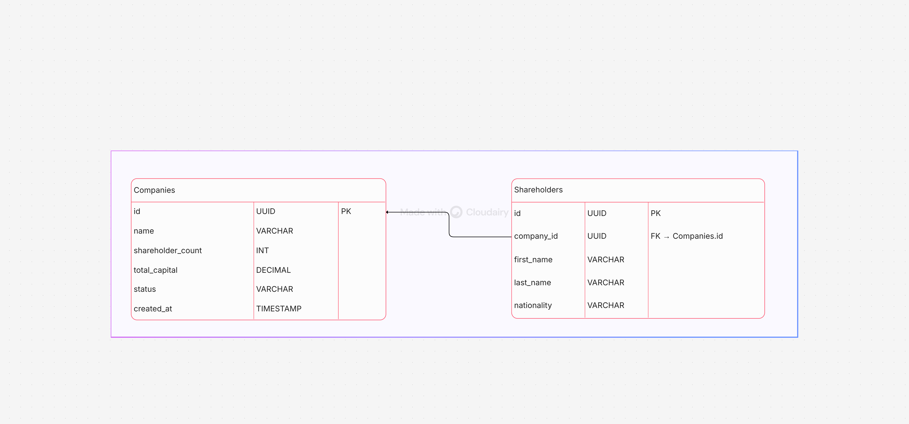

# 🚀 VentureFlow

### Modern Multi-Step Company Incorporation & Registry System


VentureFlow is a full-stack application designed to streamline legal entity registration.  
It features a **mobile-first multi-step incorporation flow** and a powerful **Admin Dashboard** to monitor venture registrations.

---

## 📸 Database Architecture

Below is the Entity Relationship Diagram (ERD) showing how **Companies** relate to **Shareholders**.



---

# 🛠 Tech Stack

### 🔹 Frontend

- React.js
- Tailwind CSS
- Lucide Icons
- Axios

### 🔹 Backend

- Node.js
- Express.js

### 🔹 Database

- PostgreSQL

### 🔹 Infrastructure

- Docker
- Docker Compose

---

# 📂 Project Structure

```text
.
├── backend/
│   ├── src/
│   │   ├── config/         # Database connection logic
│   │   ├── controllers/    # Business logic & SQL queries
│   │   ├── middleware/     # Request validation
│   │   ├── routes/         # API definitions
│   │   └── server.js        # Entry point
│   │   └── app.js
│   └── Dockerfile
│
├── frontend/
│   ├── src/
│   │   ├── components/     # Reusable UI elements
│   │   ├── pages/          # Dashboard & Incorporation flow
│   │   └── App.jsx         # Routing
│   └── Dockerfile
│
├── docker-compose.yml
├── .env.example
└── README.md
```

---

# 🚀 Getting Started

## ✅ Prerequisites

- Docker Desktop
- Git

---

# 📥 Installation

## 1️⃣ Clone the Repository

```bash
git clone https://github.com/penguin-404/company-incorporation-tool.git
cd company-incorporation-tool
```

---

## 2️⃣ Setup Environment Variables

Inside the root directory, you will find:

```
.env.example
```

Create a new file:

```
.env
```

Copy everything from `.env.example` into `.env` and modify values as needed.

### Example:

```env
# .env.example - Copy this to .env and change values

DB_USER=admin
DB_PASSWORD=changeme
DB_NAME=incorporation_db
DATABASE_URL=postgres://admin:changeme@db:5432/incorporation_db
```

⚠️ **Important:** Change `DB_PASSWORD` before production deployment.

---

# 🐳 Run With Docker (Recommended)

Since the project is fully containerized, you **do NOT need to run `npm install` manually**.

Just run:

```bash
docker compose up --build
```

Docker will:

- Build frontend
- Build backend
- Start PostgreSQL
- Configure internal networking
- Apply environment variables

---

## 🌐 Application URLs

| Service     | URL                       |
| ----------- | ------------------------- |
| Frontend    | http://localhost:5173     |
| Backend API | http://localhost:5000/api |

---

# 🧑‍💻 Run Without Docker (Optional)

If you prefer running locally without Docker:

## Backend

```bash
cd backend
npm install
npm run dev
```

## Frontend

```bash
cd frontend
npm install
npm run dev
```

⚠️ You must:

- Install PostgreSQL locally
- Create the database manually
- Update `DATABASE_URL` in `.env`

Docker is strongly recommended for consistency.

---

# 🔌 API Endpoints

## 🏢 Companies

| Method | Endpoint                     | Description                |
| ------ | ---------------------------- | -------------------------- |
| POST   | `/api/companies`             | Create new company draft   |
| PUT    | `/api/companies/:id`         | Update draft               |
| GET    | `/api/companies`             | List all companies         |
| GET    | `/api/companies/:id/details` | Get company + shareholders |
| DELETE | `/api/companies/:id`         | Delete company             |

---

## 👥 Shareholders

| Method | Endpoint                          | Description                 |
| ------ | --------------------------------- | --------------------------- |
| POST   | `/api/companies/:id/shareholders` | Add shareholders & finalize |

---

# ✨ Key Features

### 📱 Mobile-First UI

Responsive design built with Tailwind CSS.

### 💾 Draft Persistence

Uses `localStorage` + backend `PUT` logic to prevent data loss.

### 📊 Status Tracking

Automatically marks entities as:

- Draft
- Registered

### 🔐 Atomic Transactions

Backend uses SQL `BEGIN/COMMIT` to ensure data integrity.

---

# 🧪 Testing With Postman

1. Fetch companies:

```
GET http://localhost:5000/api/companies
```

2. Copy a UUID

3. Test company details:

```
GET http://localhost:5000/api/companies/YOUR-UUID/details
```

---

# 🐳 Docker Commands

Stop containers:

```bash
docker compose down
```

Reset database (remove volumes):

```bash
docker compose down -v
```

---

# 📌 Future Improvements

- Role-based authentication
- Email verification
- Document uploads
- Cloud deployment (AWS / GCP / Azure)
- CI/CD pipeline

---

# 👨‍💻 Author

Built with ❤️ using modern full-stack engineering practices.
